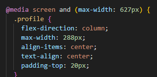
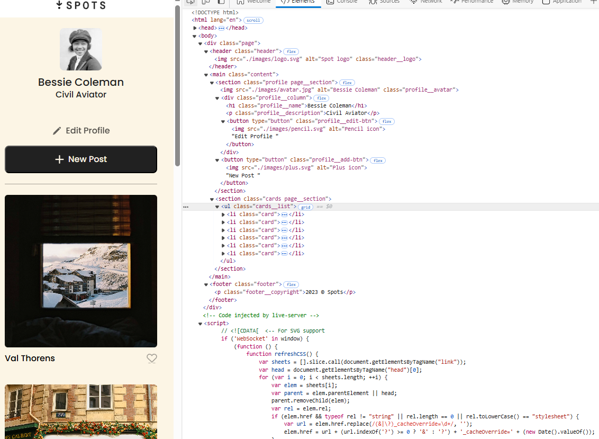

# Spots

An image sharing site.

## Description

This is the third project of the Software Engineering program at TripleTen. It was created using HTML and CSS, based on the design brief.

## Project features

- HTML
- CSS
- Flexbox
- Positioning
- Flat BEM file structure
- Responsive Design
- Grid layout
- Media screen

## Deployment

This webpage is deployed to GitHub pages

- Deployment Link: https://syerkes13.github.io/se_project_spots/
